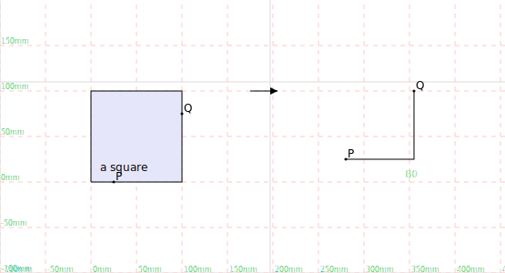
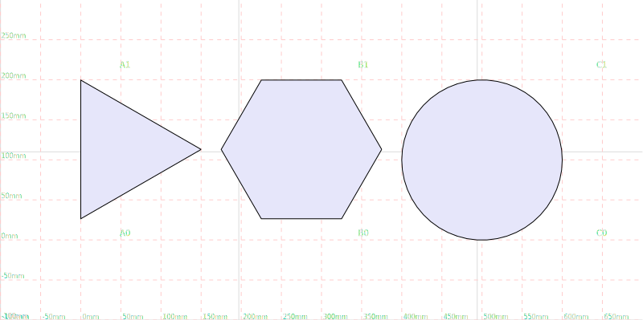

This is a python library for pattern cutting.

## `Vector` class

A class for 2d cartesian coordinates. Its used for point coordinates and
also for 2d vectors


```python
from src.geometry.Vector import Vector

origin = Vector(0,0)
origin.label = "Origin"

```

You can use the render function to generate an SVG representation of the
geometry


```python
from render import render
render(origin)
```


## Shape

A `Shape` object is defined by multiple points which are joined by line
segemnts to create a complicated line or shape.


```python
from src.geometry.Shape import Shape

square = Shape([
  Vector(0, 0),
  Vector(100, 0),
  Vector(100, 100),
  Vector(0, 100),
  Vector(0, 0)]
).with_label("a square").with_style("polygon")

render(square)
```


Using the `style` property, a polyline can be rendered as many different
kinds of shapes.


```python
from layout import topToBottom

shape = Shape([Vector(0, 0), Vector(100, 50), Vector(200, -50), Vector(300, 0)])

render(
  *topToBottom(
    shape.with_style("line").with_label("line"),
    shape.with_style("dashed").with_label("dashed"),
    shape.with_style("arrow").with_label("arrow"),
    shape.with_style("dashed_arrow").with_label("dashed_arrow"),
    shape.with_style("pointset").with_label("pointset"),
    shape.with_style("polygon").with_label("polygon"),
    shape.with_style("tape").with_label("tape"),
    shape.with_style("ruler").with_label("ruler")
  )
)
```


You can draw measurement markers along a polyline:


```python
render(
  square,
  *square.evenlySpacedMeasurements()
)
```


Or automatically detect corners:


```python
corners = square.corners()

render(
  square,
  *[corner.with_label("Here is a corner!") for corner in corners]
)
```


You can slice out a certain portion of a line:


```python
from layout import process
from src.geometry.Group import Group

P = square.at(25).point.with_label("P")
Q = square.at(175).point.with_label("Q")

render(
  *process(
    Group(
      square,
      P,
      Q,
    ),

    Group(
      square.slice(25, 175),
      P, Q
    )
  )
)
```

    None 100
    None 30
    None 75.0





The circle class can be used to generate regular polygons with so many
sides they look like a circle:


```python
from src.geometry.Circle import Circle

circle = Circle(Vector(0, 0), 100)
triangle = circle.polyline(3)
hexagon = circle.polyline(6)
almostCircle = circle.polyline(50)

from layout import sideBySide
render(*sideBySide(triangle, hexagon, almostCircle))
```

    None 150.00000000000006
    None 200.0
    None 200.0





We can put this together to get good approximations of measurements
along a curve:


```python
arc = circle.polyline(100).slice(0, 150)
render(
  arc,
  *arc.evenlySpacedMeasurements()
  )
```


## Bezier Curves


```python
from src.geometry.Shape import dashed
from src.geometry.bezier import BezierCurve
p0 = Vector(0,0).with_label("p0")
p1 = Vector(0, 50).with_label("p1")
p2 = Vector(50, 50).with_label("p2")
p3 = Vector(50, 100).with_label("p3")


mycurve = BezierCurve(p0, p1, p2, p3)

render(
  mycurve.demo()
  )
```


### Interpolating a `Shape` with Bizier Curves


```python
myshape = Shape([Vector(0,0), Vector(0, 200), Vector(200,250), Vector(250, 150), Vector(300 , 300)])

render(
  myshape.with_style("dashed"),
  myshape.interpolate(),
)
```


This makes a lot of points apear, so it might be a good idea to resample
the curve at lower resolution:


```python
interpolated = myshape.interpolate()
downsampled = interpolated.resample(25)
render(
  *topToBottom(
    interpolated.with_style("pointset"),
    downsampled.with_style("pointset").with_label("Re-sampled")
  )
)
```


Demonstrating different curve speeds


```python
gen = [myshape]
for i in range(0, 20):
  next = myshape.interpolate((i+1) / 4)
  gen.append(next)

render(*gen)
```


## Finding the closest point on a polyline

We can find the closest point on a polyline to any given coordinate:


```python
from src.geometry.Shape import dashed_arrow
shape = arc
X = Vector(90, 100)
Y = shape.closestPoint(X)

render(
  shape,
  X.with_label("X"),
  Y.with_label("Y"),
  dashed_arrow(X, Y)
)
```


You can use closest points in other methods too, such as `slice`


```python
shape = arc
P = Vector(90, 100).with_label("P")
Q = Vector(100, 0).with_label("Q")
sliced = shape.slice(P, Q)
render(
  *process(
    Group(
      P,
      Q,
      dashed_arrow(P, shape.at(P).point),
      shape.with_label("Original"),
    ),
    Group(
      sliced.with_label("sliced"),
      *sliced.points, P, Q
    )
  )
  )
```

    None 92.95272905355262
    None 30
    None 32.867184771461226


## Replacing a section of a shape

Here are two shapes


```python
a = Shape([Vector(-100, 200), Vector(200, -100)])
b = arc

render(a.with_label("a simple shape"), b.with_label("replacement"))
```


We can replace a region of one with the other


```python
render(a.replace(b))

```


## Die Lemma dress block

One of the main applications of this library is to create outfits for
East London drag queen [Die
Lemma](https://www.instagram.com/die.lemma/).

A dress block for Die was created and digitised into this library:


```python
from DieLemmaDressBlock import DieLemmaDressBlock

render(DieLemmaDressBlock)
```


Drawing parallels to a complex polyline:


```python
render(
  DieLemmaDressBlock,
  DieLemmaDressBlock.parallel(50),
  *[dashed_arrow(P, Q) for P,Q in zip(DieLemmaDressBlock.points, DieLemmaDressBlock.parallel(50).points)],
  *DieLemmaDressBlock.points
)
```


or drawing inside the shape instead of outside,


```python
render(
  DieLemmaDressBlock,
  DieLemmaDressBlock.parallel(-25),
  *[dashed_arrow(P, Q) for P,Q in zip(DieLemmaDressBlock.points, DieLemmaDressBlock.parallel(-25).points)],
  *DieLemmaDressBlock.points
)
```


## Winnifred Owen pattern blocks

### Trouser block


```python
from TheClassicTailoredTrouserBlock import TheClassicTailoredTrouserBlock

render(TheClassicTailoredTrouserBlock())
```


## Working in 3D

Turn a 2d shape into 3d one (and back again to render it):


```python
square3d = square.to3D()

render(square3d.isometric())
```


## Making a skirt for myself

I would like a skirt. To get one, I’ve measured my body a little bit:


```python
joelle_waist = 725
joelle_hips = 900
joelle_waist_to_hips = 265
```

I’ve also decided a few dimensions of the skirt I’d like to make:


```python
skirt_length_below_the_hips = 380
skirt_bottom_circumference = 1200
```

Here is a graph plotting the circumference of the skirt over height:


```python
from src.geometry.Shape import measurement_from_y_axis
skirt_circumference_graph = Shape()

origin = Vector(0,0)
waist_point = Vector(joelle_waist, 0)
hips_point = Vector(joelle_hips, -joelle_waist_to_hips)
hem_point = Vector(skirt_bottom_circumference, -joelle_waist_to_hips - skirt_length_below_the_hips)

skirt_circumference_graph.lineTo(waist_point)
skirt_circumference_graph.lineTo(hips_point)
skirt_circumference_graph.lineTo(hem_point)

render(
  skirt_circumference_graph.close_against_y_axis(),
  origin,
  measurement_from_y_axis(waist_point),
  measurement_from_y_axis(hips_point),
  measurement_from_y_axis(hem_point)
  )

```


This is the circumference of the skirt over elevation. But I think what
I need (in order to get the scrolled hem I’m looking for) is the radius.
To keep it simple I’ll imagine the skirt as a circlular prism with
radius varying across its length.


```python
import math
skirt_radius_graph = Shape([Vector(p.x / (2*math.pi),  p.y) for p in skirt_circumference_graph.points])
render(skirt_radius_graph)
```


This is a reasonable approximation for the silhouette of the skirt.

Now I’ll add the scroll


```python
from src.geometry.Circle import arc


scroll = arc(
  center= skirt_radius_graph.end() + Vector(85, 0),
  radius = 85,
  startAngle=-math.pi,
  angleSize=2*math.pi
)

render(skirt_radius_graph, scroll )
```


Now lets subdivide this into 10 pattern pieces:


```python
pattern_piece = skirt_circumference_graph.close_against_y_axis().subdivide_by_width(10)
render(pattern_piece.with_style("join_the_dots"))
```


